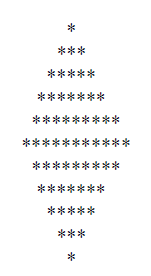
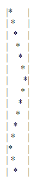

**1.** Klavyeden bir n sayısı okuyunuz ve aşağıdaki deseni oluşturan programı yazınız (örneğimizde n = 6’dır):

**2.** Parametresi ile aldığı long türden saniye cinsinden süreyi saat, dakika ve saniye olarak ayrıştırarak ekrana
yazdıran **displayDuration** isimli metodu yazınız. Eğer saat, dakika ya da saniye değeri 0(sıfır) ise ekrana
yazdırılmayacaktır.

**3.** Bir sayının asal çarpanlarını yazdıran programı yazınız. Örneğin

Sayı: 12
2 2 3

**4.** Klavyeden bir height ve width değişkenleri için sayılar okuyunuz ve aşağıda ki deseni oluşturunuz:

Burada  *height* toplam satırların sayısı *width* ise karakterlerinin arasındaki karakter alanı sayısıdır.

**5.** 2’den büyük tüm çift sayılar iki asal sayının toplamı biçiminde yazılabilir Goldbach teoremi). Klavyeden bir
çift sayı alan ve bunu iki asal sayının toplamı biçiminde yazdıran programı yazınız. 

Örneğin:
Sayı: 16

11 + 5